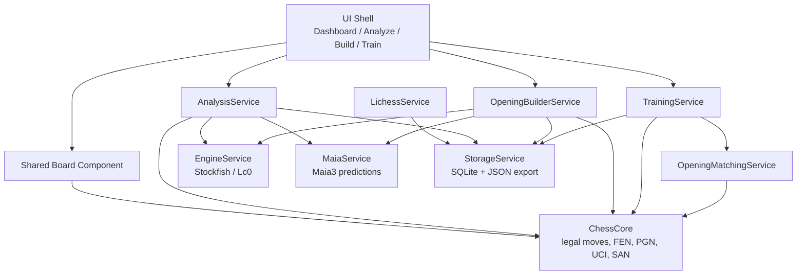

# PrepForge Chess Architecture

## 1. Product Goal

PrepForge Chess is one local-first application with three workspaces:

- **Analyze**: import PGN or Lichess games, run engine analysis, classify every move, show eval curve and key moments.
- **Build**: create and maintain opening repertoires with Stockfish recommendations, Maia-style human branches, health checks, coverage maps, and priority queues.
- **Train**: review prepared lines with saved randomized order, mistake retry, spaced repetition, and Lichess practical matching.

The central design rule is that every module shares the same chess core, data model, engine adapters, and storage layer. UI modules display state and trigger commands; they do not own chess rules or engine logic.

## 2. Recommended Technical Architecture

Phase 1 in this repo starts with a Python core because the current environment has Python and git available, while Node/npm are not usable. The architecture still allows a future React/Electron, Qt, or web UI.



### Service Boundaries

- **ChessCore**
  - Owns legal moves, check/checkmate/stalemate, castling, en passant, promotion, FEN, PGN parsing, SAN/UCI conversion.
  - Should use a proven chess rules library or a thoroughly tested internal wrapper.

- **EngineService**
  - Runs Stockfish and later Lc0 as cancellable jobs.
  - Caches evaluations by `(fen, engine, depth/nodes/time, options)`.
  - Exposes candidate lines and best move evaluations to services.

- **MaiaService**
  - Returns human move probability distribution for a FEN.
  - Supports rating buckets later.
  - Caches predictions by `(fen, model, rating_bucket)`.

- **AnalysisService**
  - Imports move list, asks EngineService for before/after/best evaluations, classifies moves, computes eval graph, identifies key moments.
  - Contains brilliant scoring orchestration, not UI.

- **OpeningBuilderService**
  - Owns repertoire tree editing, node metadata, generation, branch pruning, health check, coverage map, and priority queue.
  - Must support generation from any node, not only root.

- **TrainingService**
  - Owns session creation, saved random order, resume, mistake queue, and spaced repetition.

- **OpeningMatchingService**
  - Compares practical games against all repertoires of the user's color and selects the deepest match.

- **LichessService**
  - Fetches recent games and stores import results.
  - Does not classify or match openings directly; it delegates.

- **StorageService**
  - SQLite persistence, backups, PGN/JSON/repertoire package export.

## 3. Core Data Models

Python definitions live in `src/prepforge_chess/core/models.py`.

Required model coverage:

- **Game**: source, players, result, initial FEN, PGN, Lichess id, moves.
- **Position**: FEN, side to move, move number, legal moves, tags.
- **MoveRecord**: UCI, SAN, FEN before/after, ply, move number, side to move, eval before/after, best move, classification, comment, tags, source.
- **AnalysisResult**: game id, engine config, move results, summary, critical plies.
- **OpeningLine**: named ordered node list.
- **OpeningNode**: repertoire tree node with move, FEN, eval, Maia probability, mainline/prepared flags, priority, comment, tactical warning, plan, source.
- **Repertoire**: name, color, root FEN, branch settings, engine/model settings, notes.
- **TrainingSession**: saved line order, current index, current node, mistakes, mastered nodes, seed.
- **TrainingProgress**: attempts, correctness, SRS score, due date, mastered flag.
- **UserProfile**: display name, Lichess username, engine defaults.
- **EngineEvaluation**: engine, depth/nodes/time, cp/mate score, best move, PV, WDL.
- **MaiaMovePrediction**: FEN, move, probability, model, bucket, rank.
- **LichessGameImportResult**: import summary with imported/skipped/errors.

### Move Storage Rule

Every move must store at least:

- UCI move
- SAN move
- FEN before move
- FEN after move
- move number and ply
- side to move
- engine eval before and after
- best move and best move eval
- classification
- comment and tags
- source

SAN is display text, not identity.

## 4. Database Schema

The SQLite DDL is in `src/prepforge_chess/storage/schema.sql`.

Main tables:

- `games`, `moves`, `positions`
- `engine_evaluations`, `analysis_results`
- `maia_predictions`
- `repertoires`, `opening_nodes`, `opening_lines`
- `generation_runs` for undoable generation
- `training_sessions`, `training_progress`, `training_mistakes`
- `lichess_imports`, `practical_opening_matches`
- `user_profiles`, `engine_settings`, `app_settings`

JSON columns are used for tags, PVs, summaries, line order, and undo logs. The stable identifiers remain normalized in regular columns.

## 5. Shared Board Component

The board must be reusable in Analyze, Build, and Train.

Required interactions:

- drag piece to move
- click piece to show legal moves
- click target square to move
- promotion selector
- support castling, en passant, check, checkmate, stalemate
- keyboard navigation

Required overlays:

- legal move dots
- last move highlight
- arrows
- colored squares
- engine best move
- user mistake move
- prepared repertoire move
- expected opponent move

Board inputs should be declarative:

```text
BoardState = {
  fen,
  selectedSquare,
  legalMoves,
  lastMove,
  arrows[],
  highlightedSquares[],
  expectedMoves[],
  mode: analyze | build | train
}
```

The board emits `MoveIntent(from, to, promotion?)`; ChessCore validates and returns a committed `MoveRecord`.

## 6. UI Wireframe

### Dashboard

Purpose: start useful work within 10 seconds.

Layout:

- top command/search bar: game, FEN, opening name, shortcut hints in tooltips only
- left column: today's training recommendation
- center: recent Lichess practical departures and analysis queue
- right column: repertoire confidence cards
- bottom: coverage summary and priority branches

Metrics:

- Coverage
- Engine Safety
- Memorization
- Recent Practical Success
- high-probability unprepared branches

### Analyze

Layout:

- left: PGN/Lichess import panel, game list, analysis settings
- center: shared board
- right: move classification list and current move details
- bottom: eval graph with jump markers for brilliant, blunder, mistake, missed win

Actions:

- import/paste PGN
- fetch Lichess username
- choose depth/engine
- start/cancel analysis
- add position to repertoire
- add mistake to training queue

### Build

Layout:

- left: repertoire tree browser
- center: shared board
- right: current node inspector
- bottom: move timeline and branch filter tabs

Filters:

- Mainline only
- All branches
- Human-likely branches
- Engine-critical branches
- Mistake traps

Node indicators:

- mainline
- user prepared move
- high Maia probability
- tactical warning
- engine disagreement
- critical position

### Train

Layout:

- left: repertoire/session selector
- center: shared board
- right: expected line, feedback, mistake queue
- bottom: progress timeline and SRS due list

Modes:

- all lines
- mistakes only
- high priority
- recently seen in practical games
- one opening only

## 7. Opening Builder Context Menu

Right click on a tree node, move list row, board current position, or opening node should show:

- Set as mainline
- Mark as prepared move
- Add comment
- Add tag
- Rename / edit node metadata
- Delete branch
- Disable branch
- Export branch as PGN
- Copy FEN
- Copy line PGN
- Analyze position
- Add to training queue
- Mark as critical position
- Generate from this position

### Generate From This Position

Supported roots:

- repertoire root
- middle of mainline
- opponent branch
- manually added position
- practical game departure position
- critical position

Generation dialog fields:

- generation depth
- max nodes
- own-side candidate count
- opponent mainline source: Stockfish / Maia3 / Mixed
- opponent branch threshold, default 10%
- sub-branch threshold, default 30%
- engine depth/time/nodes
- overwrite existing analysis
- preserve manually prepared move
- auto-add to training queue
- human-likely only
- engine-critical only
- tactical warning scan

Non-destructive rules:

- do not delete manual nodes
- do not overwrite user comments
- do not silently change the user's mainline
- merge duplicate move nodes by metadata update
- if Stockfish disagrees with prepared move, mark `engine_disagreement`
- record undo log in `generation_runs`

After generation, UI must show:

- added node count
- updated node count
- high-probability unprepared moves
- engine-critical positions
- tactical warnings
- engine disagreements
- training queue additions

The tree expands to the generated area and highlights new nodes.

## 8. Game Analysis Classification

Use win-probability loss as the main axis and centipawn loss as supporting evidence. This avoids treating `+8 to +6` the same as `0 to -2`.

Configurable thresholds:

- Best: near-zero practical loss
- Excellent: small loss
- Good: playable human move
- Inaccuracy: clear but recoverable drop
- Mistake: large practical drop
- Blunder: decisive practical drop
- Missed win: best move reaches decisive win probability and played move gives up too much
- Book: known opening/repertoire move

Pseudocode:

```text
classify_move(move, side, played_eval_after, best_eval_after, config):
    if move.is_book:
        return Book

    played_wp = win_probability(played_eval_after, side)
    best_wp = win_probability(best_eval_after, side)
    wp_loss = max(0, best_wp - played_wp)
    cp_loss = side_adjusted_cp(best_eval_after) - side_adjusted_cp(played_eval_after)

    if brilliant_score >= config.brilliant_min and wp_loss <= excellent_threshold:
        return Brilliant

    if move.uci == best_move_uci:
        return Best

    if best_wp >= missed_win_best_wp and wp_loss >= missed_win_loss:
        return MissedWin

    if wp_loss <= best:
        return Best
    if wp_loss <= excellent:
        return Excellent
    if wp_loss <= good:
        return Good
    if wp_loss <= inaccuracy:
        return Inaccuracy
    if wp_loss <= mistake:
        return Mistake
    return Blunder
```

## 9. Brilliant Detection

Brilliant means a move that is **hard for a human to find, looks bad at a
glance, but is objectively strong**. The human model is **Maia3**; the
objective truth is **Stockfish**. **No Lc0 is involved.** Implemented in
`services/brilliant.py::BrilliantAnalyzer` (human signals via
`Maia3Adapter.move_assessment`).

Three layers, **all** required:

1. **Unintuitive** — Maia3's policy probability of the move ≤
   `max_human_probability` (0.10): a human is unlikely to play it.
2. **Reveal** — `reveal = sf_truth_after − maia3_glance_after ≥ min_reveal_score`
   (0.30): Maia3's value of the resulting position (human first impression) is
   poor, but Stockfish's truth is high. Also `sf_truth_after ≥ sf_before −
   max_high_drop_vs_before` (0.05).
3. **Sound** — classified **Best or Excellent** by Stockfish, and
   `sf_truth_after ≥ min_high_win_chance` (0.50).

```text
is_brilliant(move):
    if classification not in {Best, Excellent}:   return ineligible
    human_p, glance = maia3.move_assessment(before, move)  # policy + value
    truth  = stockfish_wc(after)                           # already computed
    reveal = truth - glance
    return human_p <= max_human_probability
       and reveal >= min_reveal_score
       and truth  >= sf_before - max_high_drop_vs_before
       and truth  >= min_high_win_chance
```

The unintuitive layer is what rejects the *follow-ups* of a combination (an
obvious fork/recapture is high-probability for a human even if it posts a big
reveal); the reveal layer rejects quiet good moves that are unintuitive but
don't actually look bad. Maia3 is required — `MockMaia` disables Brilliant.

Validated on the Gold Coin game (Levitsky–Marshall 1912) for **both** mating
continuations (`24.Qxg3 …Ne2+ Kh1 …Nxg3+` and `24.fxg3 …Ne2+ Kh1 …Rxf1#`): each
flags exactly **23...Qg3!!** (human prob 0.000, glance 0.39, truth 0.86, reveal
+0.47). The fork/recapture follow-ups Ne2+ (p≈0.79), Nxg3+ (p≈0.81) and Rxf1#
(p≈0.99) are rejected as intuitive; Rh6 (p 0.09) fails the reveal. Limitation:
quiet/defensive brilliancies are not caught (they aren't "looks bad").

## 10. Opening Tree Generation

User side:

- use Stockfish recommendations
- keep top N candidate moves
- preserve manual preferred/prepared moves
- mark disagreement instead of replacing user choices

Opponent side:

- mainline can be Stockfish, Maia3, or Mixed
- first opponent branch layer keeps Maia probability >= 10%
- deeper branches keep Maia probability >= 30%
- stop by max depth, max nodes, max line length

Pseudocode:

```text
generate_from_node(node, config):
    queue = [(node, 0)]
    undo_log = []

    while queue not empty and new_nodes < max_nodes:
        current, rel_ply = queue.pop()
        if rel_ply >= depth:
            continue

        if side_to_move(current.fen) == repertoire.color:
            candidates = stockfish.top_moves(current.fen, own_candidate_count)
            if current has manual prepared move:
                preserve it and mark disagreement if needed
        else:
            threshold = 10% if rel_ply <= 1 else 30%
            candidates = opponent_mainline + maia.moves_above(threshold)

        for candidate in candidates:
            if child with same UCI exists:
                merge evaluation/probability/tags
                undo_log.add(metadata_before)
            else:
                create child with source generated_stockfish/generated_maia3
                undo_log.add(created_node_id)

            scan tactical warning if enabled
            enqueue child

    persist generation run and undo log
```

## 11. Repertoire Matching

When importing recent Lichess games:

- determine user's color
- load all repertoires for that color
- compare game moves against every repertoire
- choose the repertoire with the most matched plies

Pseudocode:

```text
match_game(game, repertoires, user_color):
    best = None

    for repertoire in repertoires where repertoire.color == user_color:
        node = repertoire.root
        matched = 0

        for move in game.moves:
            child = node.child_by_uci(move.uci)
            if child does not exist:
                reason = user_left_preparation if move.side == user_color
                         else opponent_unprepared_branch
                result = Match(repertoire, matched, node, move.ply, reason)
                break

            node = child
            matched += 1

        best = max(best, result, key=matched)

    if best.reason == user_left_preparation:
        add departure node to training mistake queue
    if best.reason == opponent_unprepared_branch:
        add branch task to Opening Builder priority queue
```

## 12. Training Session Resume

The training order is generated once and saved.

Pseudocode:

```text
start_training(repertoire, mode):
    existing = storage.find_active_session(repertoire.id, mode)
    if existing:
        return existing

    line_ids = select_lines(repertoire, mode)
    seed = secure_random()
    line_order = shuffled(line_ids, seed)
    session = TrainingSession(repertoire.id, mode, line_order, current_index=0, seed=seed)
    storage.save(session)
    return session

resume(session_id):
    session = storage.load(session_id)
    board.load(session.current_node_id or first node in current line)
```

## 13. Mistake Queue and Spaced Repetition

Rules:

- wrong move immediately shows correct move and short explanation
- node is inserted into mistake queue
- later in the same session, the same node must be reviewed until correct
- repeated correct answers increase SRS score and due interval
- wrong answers cut SRS score and make the node due soon

Pseudocode:

```text
record_attempt(node, correct):
    progress.attempts += 1
    progress.last_reviewed = now

    if correct:
        remove node from session.mistakes if present
        progress.correct_attempts += 1
        progress.srs_score = min(10, progress.srs_score + 1)
        progress.due_at = now + days(round(progress.srs_score))
        if progress.srs_score >= 7 and correct_attempts >= 3:
            progress.mastered = true
    else:
        add node to session.mistakes
        progress.srs_score *= 0.5
        progress.due_at = now + 10 minutes

    save session and progress
```

## 14. Added High-Value Product Features

### Today's Training Recommendation

Dashboard computes:

- due SRS nodes
- recent mistakes
- low memorization repertoires
- high practical frequency unprepared branches
- low coverage repertoires

### Practical Error Backflow

After Lichess matching:

- user departure -> ask/add to training queue
- opponent novelty -> add to builder priority queue
- engine-critical departure -> mark critical

### Repertoire Confidence Score

Suggested metrics:

- Coverage: practical probability covered by prepared lines
- Engine Safety: share of nodes above configured eval threshold
- Memorization: SRS/mastery progress
- Recent Practical Success: recent games staying in prep and scoring acceptably

### Human Mistake Trap Finder

Find opponent moves that are:

- high Maia/Lichess probability
- objectively worse by Stockfish
- tactically punishable
- not yet tagged as prepared trap

### Multi-Engine Disagreement

Flag positions where Stockfish, Lc0, and Maia disagree:

- Engine disagreement
- Human trap
- Long-term compensation
- Tactically unclear
- Practical choice

## 15. MVP Implementation Plan

### Phase 1: Shared Core and Board

- choose chess rules library or implement adapter
- create ChessCore wrapper
- PGN import and move normalization
- FEN/UCI/SAN conversion
- shared BoardState contract
- SQLite migration runner
- basic game/move/repertoire persistence

### Phase 2: Game Analysis

- Stockfish process adapter
- analysis job queue with progress/cancel
- move classification
- eval graph data
- best move and alternative line display
- simplified brilliant scoring with Lc0 extension interface

### Phase 3: Opening Builder

- repertoire tree CRUD
- manual node editing
- Stockfish candidate generation
- Maia prediction adapter
- generate from root and arbitrary node
- context menu and undoable generation runs
- JSON/PGN export

### Phase 4: Opening Trainer and Lichess Matching

- session creation/resume
- saved randomized line order
- mistake queue
- SRS progress
- Lichess import
- multi-repertoire matching
- backflow to Build/Train queues

## 16. Suggested File Structure

```text
PrepForge Chess/
  docs/
    ARCHITECTURE.md
  src/prepforge_chess/
    core/
      models.py
      chess_core.py
      pgn.py
    services/
      classification.py
      brilliant.py
      analysis.py
      engine.py
      maia.py
      opening_generation.py
      repertoire_matching.py
      training.py
      lichess.py
    storage/
      schema.sql
      database.py
      repositories.py
    ui/
      board_contract.py
  tests/
    test_classification.py
    test_training.py
    test_repertoire_matching.py
```

## 17. First Implementable Task List

1. Add database migration runner and repository layer.
2. Add ChessCore adapter using a legal move library.
3. Implement PGN import into `Game` and `MoveRecord`.
4. Add tests for UCI/SAN/FEN round trip.
5. Implement Stockfish UCI adapter with depth/time config.
6. Persist engine evaluations by FEN/config cache key.
7. Analyze one imported PGN and persist classifications.
8. Create first UI board contract and keyboard navigation spec.
9. Add basic repertoire tree CRUD.
10. Add `Generate from this position` command object and undo log persistence.

## 18. Risk List

- **Engine performance**: full-game analysis and tree generation are expensive. Use job queue, cache, progress, cancel.
- **Maia availability**: model may not be locally installed. Keep Maia behind adapter and support cached/file predictions.
- **Brilliant over-labeling**: keep score explainable and conservative.
- **Opening tree explosion**: enforce depth, max nodes, probability threshold, and max line length.
- **Data drift**: never store only SAN; always store UCI and FEN before/after.
- **UI logic leakage**: UI must call services, not run analysis logic.
- **Saved training order**: randomize once and persist session.
- **Multiple repertoire matching**: always compare all relevant repertoires and choose deepest match.
- **Long-running imports**: Lichess import must be cancellable and resumable.

## 19. Test Plan

Unit tests:

- FEN/UCI/SAN conversion
- legal move edge cases: promotion, castling, en passant, checkmate, stalemate
- move classification thresholds and mate handling
- brilliant score penalties and reasons
- opening generation threshold selection
- duplicate node merge behavior
- repertoire deepest-match selection
- saved training order and resume behavior
- SRS update and mistake queue

Integration tests:

- import PGN -> normalize moves -> save game
- analyze PGN with mocked engine -> persist results
- generate repertoire subtree with mocked Stockfish/Maia
- train session wrong move -> mistake queue -> correct retry
- Lichess mocked games -> multi-repertoire matching -> backflow task

UI tests:

- board drag and click movement
- promotion selector
- move list jump
- eval graph jump markers
- Build context menu
- Train resume from saved session
- responsive text and no overlap in Dashboard/Analyze/Build/Train
